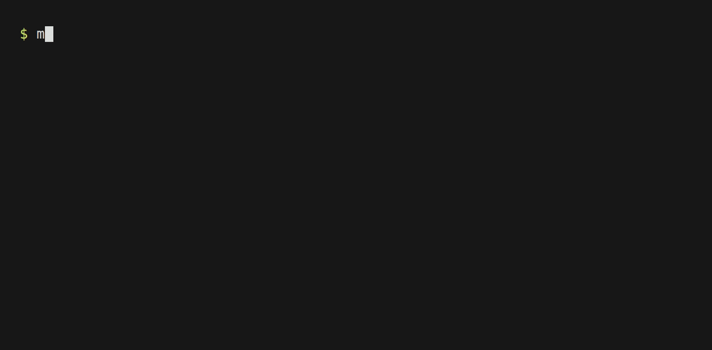

# mkimg

[](https://github.com/jmooring/mkimg/actions/workflows/test.yaml)
[](https://goreportcard.com/report/github.com/jmooring/mkimg)
[](https://github.com/jmooring/mkimg/blob/main/LICENSE)
[](https://github.com/jmooring/mkimg/releases/latest)
[](https://github.com/sponsors/jmooring)

Use `mkimg` to generate a uniform-color image and output it as raw bytes or a base64 string to either `stdout` or a file.



## Installation

Installation requires Go 1.26.0 or later.

```sh
go install github.com/jmooring/mkimg@latest
```

## Usage

```text
Usage: mkimg [flags] <width> <height> <color>

Generates a uniform-color image and outputs it as raw bytes
or a base64 string to either stdout or a file.

Arguments:
  width   image width in pixels (1–10000)
  height  image height in pixels (1–10000)
  color   hex value or CSS named color (see examples below)

Color formats:
  ff0000        6-digit hex (RGB)
  ff000080      8-digit hex (RGBA)
  f00           3-digit hex (RGB), expanded to ff0000
  f008          4-digit hex (RGBA), expanded to ff000088
  '#ff0000'     hex with # prefix (must be quoted)
  red           CSS named color
  transparent   fully transparent black

Examples:
  # Create a 6x7 semi-transparent red PNG
  mkimg -o semi-transparent-red.png 6 7 ff000088

  # Generate a 42x42 blue JPEG using shorthand hex
  mkimg -f jpeg -o blue.jpg 42 42 00f

  # Output a 1x1 transparent PNG as base64 to stdout
  mkimg -b 1 1 transparent

  # Redirect raw bytes to a file or pipe to another tool
  mkimg 100 100 red > red.png

Flags:
  -h, --help             show this help message
  -v, --version          print version and exit
  -f, --format string    output format: png, jpeg (or jpg), gif (default "png")
  -o, --output string    write output to file (default: stdout)
  -b, --base64           encode output as base64

Notes:
  - JPEG and GIF do not support an alpha channel; the alpha
    component of the specified color is ignored and all pixels
    are fully opaque.
  - Width and height are capped at 10000 pixels per side to
    prevent excessive memory use.
  - Hex digits are case-insensitive; FF0000 and ff0000 are equivalent.
```
